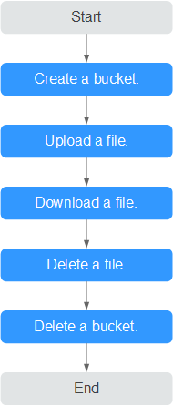

# Quick Start<a name="EN-US_TOPIC_0142373645"></a>

This section uses the Linux OS as an example to describe how to use obsutil to perform basic data access operations in OBS. For details, see  [Figure 1](#fig10397103545017).

**Figure  1**  obsutil flow for a quick start<a name="fig10397103545017"></a>  


## Prerequisites<a name="section16839141103914"></a>

-   You have obtained obsutil and completed initial configuration.
-   You have accessed to the directory where the tool is located.

## Procedure<a name="section135809001613"></a>

1.  Run the  **./obsutil mb obs://bucket-test**   command to create a new bucket named  **bucket-test**.

    ```
    ./obsutil mb obs://bucket-test
    
    Create bucket [bucket-test] successfully!
    ```

2.  Run the  **./obsutil cp /temp/test.txt obs://bucket-test/test.txt**  command to upload the  **test.txt**  file to bucket  **bucket-test**.

    ```
    ./obsutil cp /temp/test.txt obs://bucket-test/test.txt
    
    Parallel:      5                   Jobs:          5
    Threshold:     52428800            PartSize:      5242880
    Exclude:                           Include:
    VerifyLength:  false               VerifyMd5:     false
    CheckpointDir: /temp/.obsutil_checkpoint
    
    test.txt:[==============================================] 100.00% 48.47 KB/s 0s
    Upload successfully, 4.44KB, /temp/test.txt --> obs://bucket-test1/test.txt
    ```

3.  Run the  **./obsutil cp obs://bucket-test/test.txt** **/temp/test1.txt**  command to download  **test.txt**  from bucket  **bucket-test**  to a local PC.

    ```
    ./obsutil cp obs://bucket-test/test.txt /temp/test1.txt
    
    Parallel:      5                   Jobs:          5
    Threshold:     52428800            PartSize:      5242880
    Exclude:                           Include:
    VerifyLength:  false               VerifyMd5:     false
    CheckpointDir: /temp/.obsutil_checkpoint
    
    test.txt:[=============================================] 100.00% 775.52 KB/s 0s
    Download successfully, 4.44KB, obs://bucket-test1/test.txt --> /temp/test1.txt
    ```

4.  Run the  **./obsutil rm obs://bucket-test/test.txt -f**  command to delete object  **test.txt**  from bucket  **bucket-test**.

    ```
    ./obsutil rm obs://bucket-test/test.txt -f
    
    Delete object [test.txt] in the bucket [bucket-test] successfully!
    ```

5.  Run the  **./obsutil rm obs://bucket-test -f**  command to delete bucket  **bucket-test**.

    ```
    ./obsutil rm obs://bucket-test -f
    
    Delete bucket [bucket-test] successfully!
    ```


